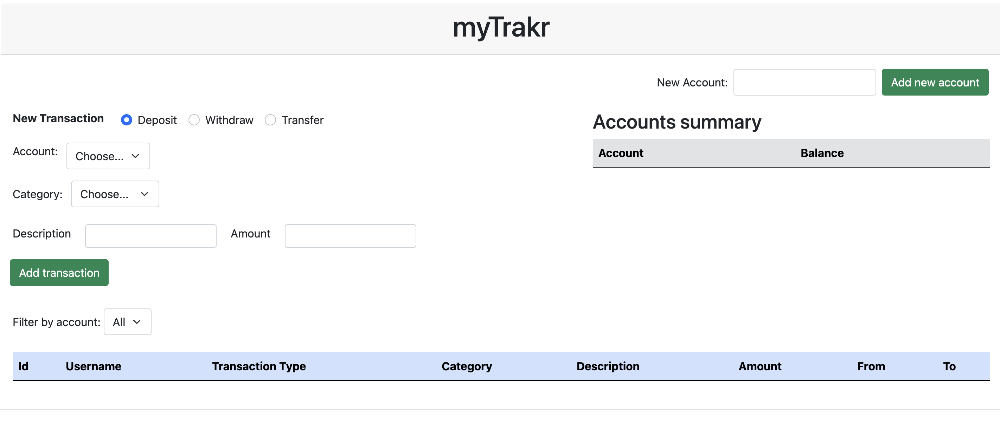

# MyTrack Project

MyTrack is a single page application that can track all your accounts and transactions.

User should be able to create multiple accounts, set transactions like deposits, withdraws and transfer between accounts.

All the data should be entered manually, but since it's posted, records will be kept in the server.

> This project has educational purpose only. Real personal data should not be entered for the sake of privacy.

With all that said, let's code! 💻 🚀

## Set up

- `npm install` to install dependencies
- `npm start` to start the server
- Run Live Server to open `index.html` on the browser.

## File Structure

For this project, only files inside `frontend` folder should be changed. If you need changes in the `server.js` or `src` folder, please ask for help first!

Inside `frontend` folder:

```
frontend
    |
    --- css
    |    |
    |    --- bootstrap.css (bootstrap file) - just in case
    |    --- index.css (yours CSS file)
    --- js
    |    |
    |    --- helpers
    |        |
    |        --- Account.js (Account Class + functions)
    |        --- Category.js (Category Class + functions)
    |        --- Common.js (common functions)
    |        --- Transaction.js (Transaction Class + functions)
    |    --- index.js (event listeners, DOM manipulation)
    --- index.html (HTML stuff) - no introductions needed
```

## How to split the project (in case of team mates)

> This is just a recommendation!

- Member 1 (Hard):
  - New Transaction section
- Member 2 (Moderate):
  - New Account section
  - Account Summary
- Member 3 (Easy):
  - Transactions list
  - Filter by account, category, transaction type (bonus)
- Bonus:
  - Notification animation when a new transaction or account is created

## API Endpoints

All the requests should have the domain of `http://localhost:3000/`.
`http://localhost:3000/accounts`

- GET `/accounts`: get all the accounts
- POST `/accounts`: saves a new account
  expects:

```js
{
  newAccount: "";
}
```

- GET `/transactions`: get all the transactions from all accounts
- POST `/transactions`: saves a new transaction
  expects:

```js
{
  newTransaction:{
    accountId:"", // account ID for Deposits or Withdraws
    accountIdFrom:"", // sender ID if type = 'Transfer', otherwise null
    accountIdTo:"" // receiver ID if type = 'Transfer', otherwise null,
    type:"", // 'Deposit', 'Withdraw', 'Transfer'
    amount:"", // amount of the transaction
    categoryId:"", // category ID
    description:"", // description of the transaction
  }
}
```

- GET `/categories`: get all the categories
- POST `/categories`: saves a new category
  expects:

```js
{
  newCategory: "",
}
```

## Screenshot

This design is just a reference, it doesn't mean that your project should looks like the same.


